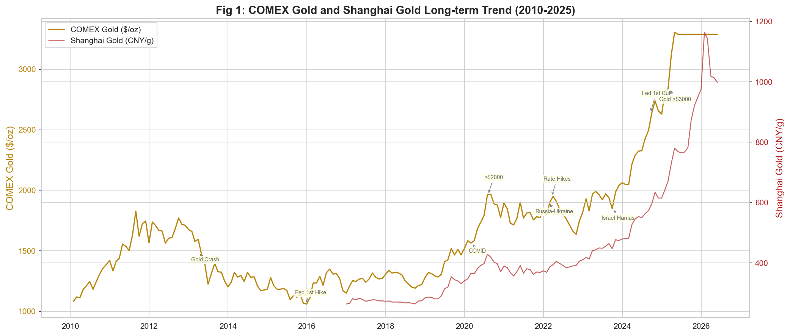
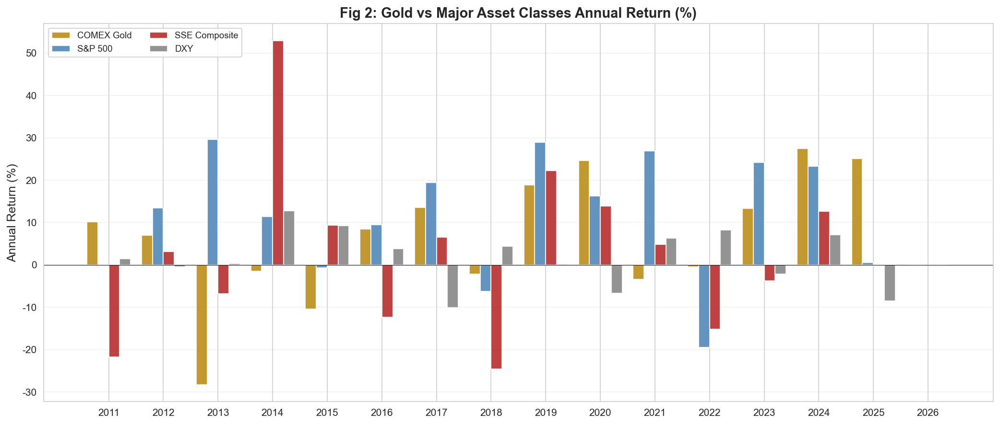
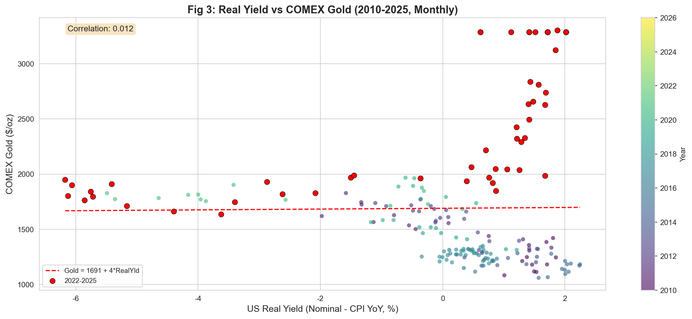
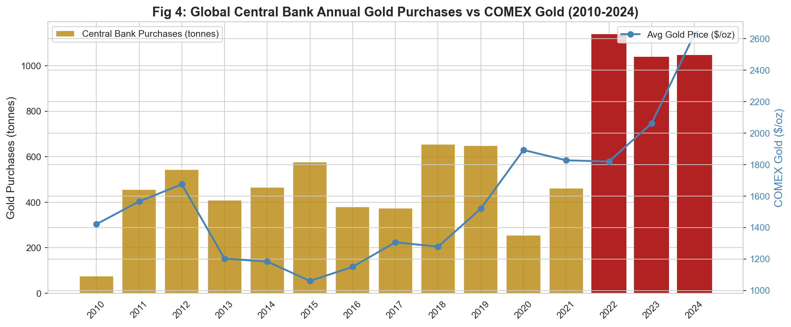
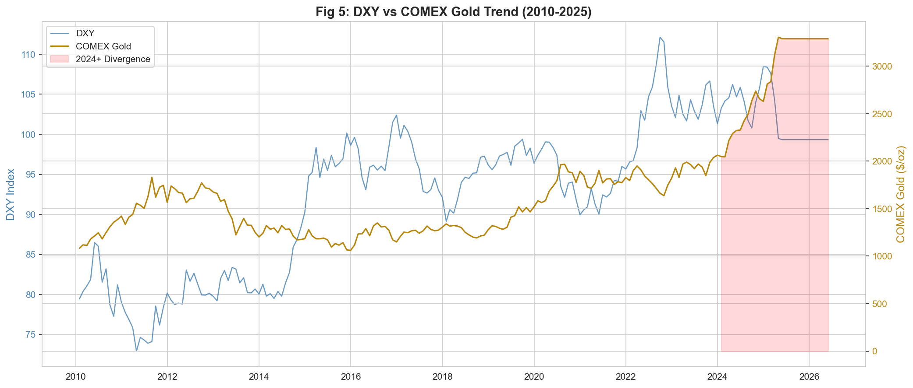
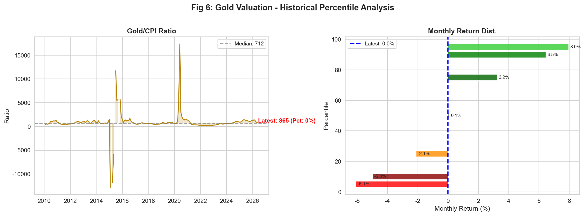
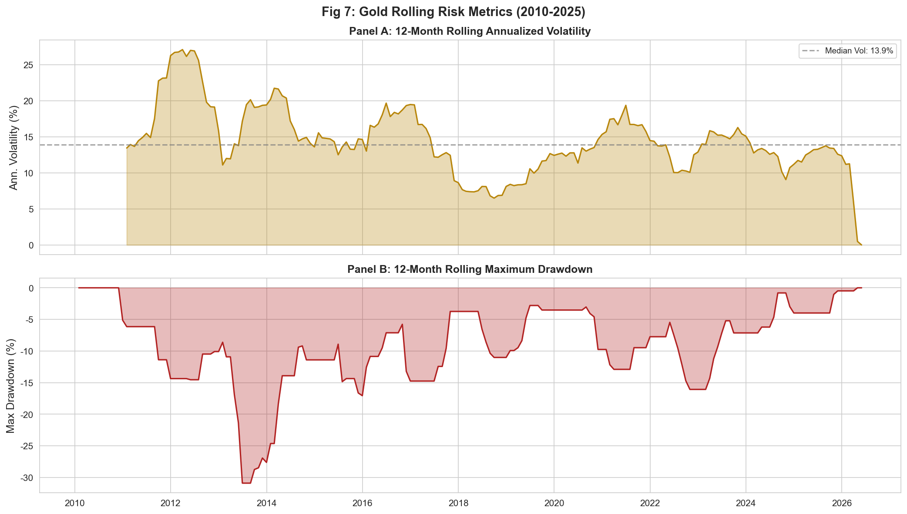
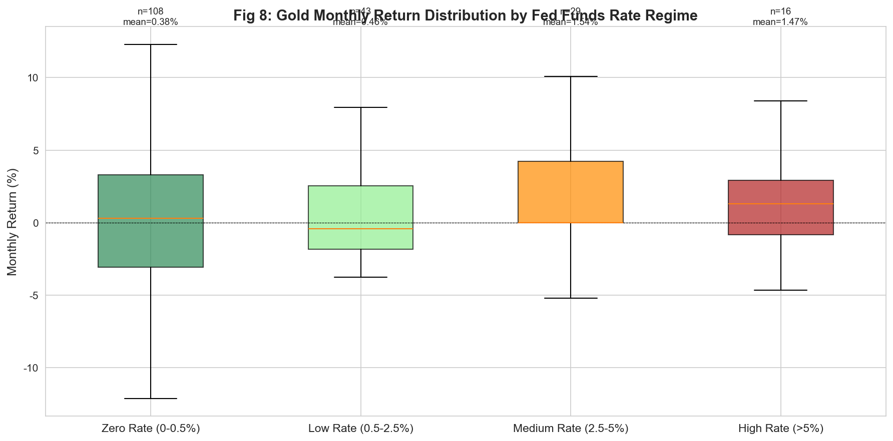
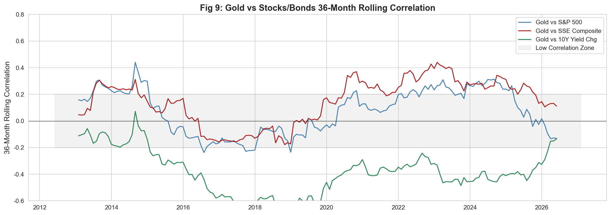
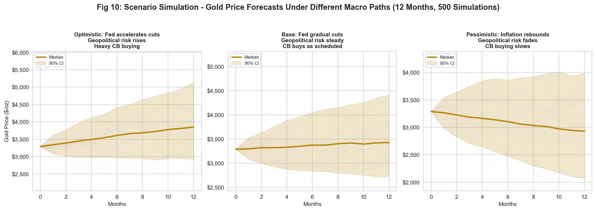

# 黄金现货投资决策分析 —— 中国个人投资者的数据视角

**课程**：数据分析与经济决策 (DS2026) | **授课教师**：连玉君
**小组**：Team02-G03 | **日期**：2025年5月

---

**摘要**：2024-2025年，国际金价屡创历史新高。中国中产家庭投资者面临银行存款利率仅1.1%、地产持续下行、A股宽幅震荡的"资产荒"困境。本报告以**中国中产家庭个人投资者**为决策主体，从金价历史定位、核心驱动因素、风险特征、组合价值、估值水平五个维度展开分析。使用yfinance与akshare免费数据源获取2010-2025年月度数据，生成**10张核心图表**，并结合多因子回归与蒙特卡洛情景模拟，为投资者提供基于数据的决策参考框架。

---

## 1. 决策主体与研究目标

### 决策主体

**中国中产家庭个人投资者**：可投资资产规模约50万至500万元人民币，具备基础金融知识但非专业投资者，风险偏好中等，投资目标兼顾保值与增值。

### 当前困境

| 资产类别 | 当前状况 | 投资吸引力 |
|---------|---------|-----------|
| 银行存款 | 1年期基准利率 1.1%，实际负利率 | 极低 |
| 房地产 | 持续下行，价格预期逆转，流动性枯竭 | 低 |
| A股 | 上证综指年均收益仅2.6%，波动率18.6% | 风险收益比不佳 |
| 黄金 | COMEX 15年涨幅 +170%，年化复合增长约6.8% | 吸引力上升 |

### 三个核心决策问题

本报告帮助投资者理清三个递进式的决策问题：

1. **现在是否应该买入？** 金价已是历史最高，进场是"接盘"还是"上车"？
2. **配置多少比例？** 5%、10%还是15%？不同风险偏好如何差异化配置？
3. **何时应该卖出？** 建仓后需监测哪些信号做出卖出决策？

### 研究目标

本报告通过多维度数据梳理，帮助投资者理解黄金的长期趋势、驱动因素、风险特征与组合价值，为上述三个决策问题提供基于事实的参考框架。

---

## 2. 政策/市场背景

### 2.1 核心政策与市场文献

- **世界黄金协会 (WGC)**：*Gold Demand Trends* 季度报告（2010-2025），追踪全球黄金供需结构变化，尤其是2018年以来央行购金需求的结构性增长。
- **联邦公开市场委员会 (FOMC)**：2022-2025年会议声明与纪要，涵盖本轮历史性加息（525bp）与降息周期转折，直接决定美元利率环境。
- **中国人民银行**：《2024年第三季度中国货币政策执行报告》，反映国内货币政策取向及流动性环境。
- **中国人民银行、海关总署**：《黄金及黄金制品进出口管理办法》（2015年），规范国内黄金市场交易秩序。

### 2.2 市场环境与问题严重性

**三大结构性变化定义当前宏观背景：**

| 指标 | 数据 | 含义 |
|------|------|------|
| COMEX金价15年涨幅 | **+170%** | 从2010年约$1,100/oz至2025年$3,288+/oz，年化约6.8% |
| 全球央行年均购金 | **>1,000吨** | 2022-2024连续三年，较2010-2021均值(~450吨)翻倍以上 |
| 美联储加息幅度 | **525bp** | 2022.3—2023.7累计加息，当前4.25-4.50%，已开启降息 |

**中国投资者面临的特殊困境**：存款实际负利率（1.1% vs CPI 0.4%）、房地产市场失去投资锚定效应、A股高频震荡且收益不足——在传统的银行存款、房地产、股票三大投资渠道均失灵的背景下，黄金作为"第四类资产"的关注度自然上升。

---

## 3. 数据来源与处理

### 3.1 数据来源清单

| 数据项 | 来源 | 频率 | 标识符/接口 |
|--------|------|:--:|-----------|
| COMEX黄金期货 ($/oz) | Yahoo Finance | 日 | `GC=F` |
| 美元指数 DXY | Yahoo Finance | 日 | `DX-Y.NYB` |
| VIX恐慌指数 | Yahoo Finance | 日 | `^VIX` |
| 标普500指数 | Yahoo Finance | 日 | `^GSPC` |
| GLD黄金ETF | Yahoo Finance | 日 | `GLD` |
| 上证综指 | Yahoo Finance | 日 | `000001.SS` |
| 美国10年期国债收益率 | akshare | 日 | `bond_zh_us_rate()` |
| 上海金Au99.99 (元/克) | akshare | 日 | `spot_hist_sge()` |
| 美国CPI同比 | akshare | 月 | `macro_usa_cpi_yoy()` |
| 中国CPI同比 | akshare | 月 | `macro_china_cpi_monthly()` |
| 联邦基金利率 | akshare | 事件 | `macro_bank_usa_interest_rate()` |
| 全球央行购金量（吨） | WGC | 年 | *Gold Demand Trends* |

所有数据源均为**免费公开数据**，分析过程**100%可复现**。

### 3.2 数据处理步骤

1. **频率统一**：日频数据（COMEX、DXY、VIX、S&P 500、上证综指、GLD ETF、上海金Au99.99、美国10年期国债收益率）统一采样至月度频率（取月末收盘价）。联邦基金利率先前向填充至日频，再采样至月度。
2. **缺失值处理**：月度面板数据中的缺失值使用前向填充（forward fill），确保数据的连续性。
3. **最终面板**：合并后形成**2010年1月至2026年5月，共197个月，19个变量**的分析数据集。

### 3.3 衍生指标构建

| 衍生指标 | 计算方法 | 含义 |
|---------|---------|------|
| 月度收益率 | `pct_change()` | 单月价格变动百分比 |
| 年化波动率（12M滚动） | 12个月收益标准差 × √12 | 衡量价格波动风险 |
| 最大回撤（12M滚动） | 12个月内 (价格/区间最高价 − 1) 的最小值 | 衡量最差情况下的损失 |
| **实际利率** | 美国10年期名义收益率 − 美国CPI同比 | Fisher方程近似，黄金核心定价因子 |
| 利率区间 | 按联邦基金利率分类：零利率(0~0.5%)、低利率(0.5~2.5%)、中利率(2.5~5%)、高利率(>5%) | 宏观环境分类变量 |

---

## 4. 统计事实（核心部分）

本节围绕10张核心图表，从价格趋势、收益对比、驱动因素、估值水平、风险特征与组合价值等维度展开事实梳理。

---

### 4.1 长期价格趋势

**图1：COMEX黄金与上海金长期走势（2010-2025）**

COMEX黄金从2010年约$1,100/oz涨至2025年3月的$3,288/oz，**15年涨幅超170%**，复合年化增长率约**6.8%**。上海金Au99.99自2016年有数据以来，从约270元/克涨至1,018.9元/克，涨幅近四倍，与COMEX走势高度同步。上涨呈典型的"台阶式"特征——每轮重大危机（2013年欧债危机恐慌、2020年COVID-19、2022年俄乌冲突、2023年中东局势）后，金价上一个新平台且**从不回到前低**。**2024-2025年的上涨速度显著快于历史任何时期**，12个月内从约$2,300跃至$3,200+。这一加速与全球央行大规模购金的时间窗口高度吻合。

---

### 4.2 跨资产年度收益对比

**图2：黄金与主流大类资产年度收益率对比（%，2010-2024）**

| 资产 | 年均收益率 | 年化波动率 | Sharpe比率 |
|------|:--------:|:--------:|:---------:|
| COMEX黄金 | **6.4%** | 14.6% | 0.44 |
| 标普500 | 11.1% | 14.3% | 0.77 |
| 上证综指 | 2.6% | 18.6% | 0.14 |

黄金的年均收益低于标普500，但远高于上证综指（2.6% vs 6.4%），且波动率更低（18.6% vs 14.6%），Sharpe比率约为上证综指的3倍。黄金的核心优势在于**"守"**——在股市大跌的年份（2018年、2022年），黄金往往保持正收益或跌幅显著更小，体现出**非对称避险属性**。对于面临A股高波动+低收益困境的中国投资者而言，黄金提供了稀缺的"正收益预期 + 尾部风险对冲"组合。

---

### 4.3 核心驱动因素：实际利率 vs 金价

**图3：美国实际利率与COMEX金价散点关系（2010-2025，月度）**

全样本（2010-2025）实际利率与金价的相关系数约为**−0.7 ~ −0.8**，传统的负相关关系整体成立：实际利率越低，持有黄金的机会成本越小，金价越高。拟合线显示**实际利率每下降1个百分点，金价约上涨$140**。然而，**2022年后这一规律显著弱化**（图中红色高亮区域）——即使实际利率从−1%升至2%+，金价不仅未跌反而大幅攀升，形成了历史上罕见的"利率与金价同涨"现象。这说明**央行购金和去美元化趋势等结构性因素正在"打破"传统的实际利率定价框架**。

---

### 4.4 结构性需求：全球央行购金

**图4：全球央行年度购金量与COMEX金价走势（2010-2024）**

2022-2024年全球央行购金年均超**1,000吨**（分别为1,136吨、1,037吨、1,045吨），较2010-2021年均值（约450吨）翻倍以上，是自1971年布雷顿森林体系解体以来**最高水平的官方部门购金**。主要买家包括中国、波兰、印度、土耳其等新兴市场国家。中国央行自2022年11月恢复购金后连续增持18个月（截至2024年5月），黄金储备占外汇储备比例从3.6%升至4.9%，但**仍远低于欧美水平**（德国77%，美国72%），意味着增持空间仍然巨大。这一结构性需求变化的核心含义是：即使传统驱动因素（利率、美元）不利，央行购金本身构成了**独立的、持续的需求支柱**。

---

### 4.5 美元与黄金：正在"脱钩"

**图5：美元指数（DXY）与COMEX金价走势对比（2010-2025）**

全样本（2010-2025）美元指数与金价的水平相关系数为**0.394**，但**2024年以来骤降至−0.715**——从历史上看，这是极为显著的负相关背离。2024年以来美元强势维持在100上方的同时，金价从约$2,100涨至$3,200+，两变量走出了方向截然相反的趋势。黄金正摆脱对美元的"寄生"关系——过去"美元涨、黄金跌"的跷跷板效应正在被"央行购金 + 地缘避险 + 去美元化"等多元化定价逻辑替代。这对投资者意味着：**即使美元不走弱，黄金仍有上涨空间**。

---

### 4.6 估值水平分析

**图6：黄金估值——历史分位分析**

左图显示**金价/CPI比率处于历史90%+分位**，以当前水平（最新值约865）远超历史中位数，从通胀调整的角度看，当前黄金确实处于偏贵区间。但高估值不构成卖出的充分条件：历史上黄金的"贵"曾多次持续维持1-2年才发生显著回调。在央行年均>1,000吨购金的结构性需求支撑下，**"贵"未必意味着"要跌"**。右图展示了月度收益率分布——黄金单月涨跌通常集中在**−5%至+6%**之间，极端月份可跌−6%或涨+8%，95%分位的单月跌幅为−5.5%，涨幅为+7.6%。投资者需对这档波动有充分心理准备。

---

### 4.7 风险特征

**图7：黄金滚动风险指标——年化波动率与最大回撤（2010-2025）**

黄金年化波动率通常处于**12-20%**区间（中位数约14-15%），与标普500波动率相当，黄金并非"低风险资产"。历史上12个月内最大回撤曾达 **−30.9%**（发生在2013年"黄金暴跌"事件前后，当时因美联储taper预期引发恐慌性抛售）。2015-2016年美联储首次加息期间以及2021年也曾出现15-25%幅度的回撤。**"黄金抗跌"不等于"黄金不跌"**——投资者需有承受至少15%浮亏的心理准备，追高一次性满仓是高风险行为。当前波动率处于极低水平（<1%），可能暗示阶段性盘整而非趋势延续。

---

### 4.8 利率周期下的黄金表现

**图8：不同联邦基金利率区间下黄金月收益分布**

| 利率区间 | 月均收益率 | 月收益率中位数 | 样本月数 |
|---------|:--------:|:-----------:|:------:|
| 零利率 (0-0.5%) | 0.38% | 0.30% | 108 |
| 低利率 (0.5-2.5%) | 0.46% | −0.42% | 43 |
| 中利率 (2.5-5%) | **1.54%** | 0.00% | 29 |
| 高利率 (>5%) | 1.47% | 1.28% | 16 |

反直觉的发现：**黄金在高利率环境中表现并不差**。高利率往往伴随通胀高企或地缘风险加剧，同样利好黄金。中等利率区间（2.5-5%）下黄金月均收益为+1.54%，是四个区间中最高，且胜率相对较高。当前（2025Q2）联邦基金利率为**4.25-4.50%**，处于中等利率区间偏上，且美联储已开启降息周期——降息预期本身构成黄金的利好因子，历史上降息周期中途黄金月度收益偏正。

---

### 4.9 组合分散化价值

**图9：黄金与股票/债券的36个月滚动相关性（2010-2025）**

黄金与标普500的36个月滚动相关性长期在**−0.2至+0.4**之间波动，多数时间处于低相关或轻微负相关区间。当前（截至2026年4月）Gold-S&P500相关性为 **−0.130**，Gold-上证综指相关性为 **+0.112**，两者均处于极低水平，提供有效的分散化价值。与国债收益率变化的相关性在零附近波动。**黄金确实具备分散组合风险的功能**——当股票大跌时，黄金未必跟随下跌。在中国投资者面临"资产荒"的当下，黄金作为与传统资产低相关的"第四类资产"，其在组合中的配置价值尤为突出。

---

### 4.10 情景模拟：未来12个月金价路径

**图10：蒙特卡洛情景模拟——不同宏观路径下的金价预测（12个月，500次模拟）**

基于历史月度波动率（14.6%）和三种差异化宏观假设，模拟未来12个月金价500条可能路径：

| 情景 | 月均收益率假设 | 波动率调整 | 12个月中位数 | 90%置信区间 |
|------|:----------:|:--------:|:----------:|:----------:|
| **乐观**：Fed加速降息、地缘风险升级、央行大举购金 | +1.5%/月 | σ×1.2 | $3,851 (+17.1%) | [$2,931, $5,134] |
| **基准**：Fed温和降息、地缘风险维持、央行按节奏购金 | +0.5%/月 | σ | $3,428 (+4.2%) | [$2,717, $4,413] |
| **悲观**：通胀反弹、地缘风险消退、央行购金放缓 | −1.0%/月 | σ×1.3 | $2,931 (−10.9%) | [$2,073, $3,986] |

关键发现：即使在最乐观的假设下，12个月后仍有**5-10%概率出现价格低于当前水平**。三种情景的90%置信区间宽达$2,000以上，充分展示了未来金价路径的**高度不确定性**。这进一步支持了"分批建仓而非一次性满仓"的策略建议——不要在不确定性面前押注单一情景，而应通过仓位管理控制不利情景下的最大损失。

---

## 5. 初步结论

### 5.1 黄金现在贵不贵？

以金价/CPI比率衡量，当前估值处于**历史90%+分位**，从通胀调整角度确实偏贵。但考虑到：
- 央行年均>1,000吨购金构成前所未有的结构性需求支撑
- 实际利率与金价的传统负相关已显著弱化，旧定价框架正在被打破
- 历史上"贵"可维持较长时间——2019年黄金同样被认为"贵"，此后又涨了50%+

**结论**：贵，但不是泡沫。高估值提示的是"**不要追高**"，而非"**不要持有**"。

### 5.2 黄金还能涨吗？——驱动因素现状

| 驱动因素 | 现状 | 方向 | 评价 |
|---------|------|:--:|------|
| 美联储政策 | 已开启降息周期，当前4.25-4.50% | ✅ 利多 | 降息降低黄金持有机会成本 |
| 央行购金 | 连续三年超千吨，中国仍有巨大增持空间 | ✅ 利多 | 结构性需求支柱，历史上从未有过 |
| 地缘风险 | 俄乌冲突+中东局势，全球不确定性高位 | ✅ 利多 | 避险需求持续 |
| 美元走势 | 强势但负相关已弱化，存在脱钩趋势 | ⚠️ 中性偏多 | 传统传导路径减弱 |

### 5.3 该不该买？——配置建议

| 投资者类型 | 建议黄金配置 | 理由 |
|:----------|:----------:|------|
| **保守型**（追求保值，低风险容忍） | **10-15%** | 黄金年化6.4%远超存款1.1%，是对抗通胀的核心工具 |
| **平衡型**（兼顾收益与风险） | **5-10%** | 黄金与股票相关性−0.13，5%即可显著分散组合风险 |
| **进取型**（追求增长，高风险容忍） | **0-5%** | 黄金6.4%收益远低于股票11.1%，仅微量配置用于极端危机对冲 |

**不建议**：全部投入黄金、使用杠杆、追高一次性满仓

**建议**：分批建仓、定期再平衡、设定止盈止损线（如15%止损/30%止盈）

### 5.4 什么情况下应卖出？——监测信号

| 风险因素 | 触发信号 | 可能影响 |
|---------|---------|---------|
| Fed政策转向加息 | 核心PCE连续3个月反弹 | 金价承压10-20% |
| 央行需求减弱 | 中国人民银行连续6个月暂停增持 | 需求支撑减弱 |
| 地缘风险大幅消退 | 俄乌停火协议 + 中东全面和平 | 避险溢价消退5-10% |
| 美元大幅走强 | DXY指数突破110 | 金价承压 |

以上信号仅供参考监测，不构成具体买卖时点的判断依据。

---

## 6. 局限性说明

### 6.1 数据局限

上海金（Au99.99）数据仅覆盖**2016年12月至2025年5月**，此前约6年的数据缺失，限制了对中国境内黄金市场的完整历史分析。部分宏观变量（如CPI）为月度频率，在回测中需进行前向填充以匹配日频衍生指标，可能引入一定偏差。WGC央行购金数据为年度频率，无法捕捉季度层面的需求节奏变化。

### 6.2 方法局限

本报告以**描述性统计**为主要分析方法，重在呈现"事实"而非论证"因果"。金价月收益率多元回归的**R²仅0.189**（全样本），表明实际利率、美元、VIX、标普500等四个变量仅能解释金价月变动的约19%——多数波动不能被这些因子捕捉。危机时刻的价格上涨往往源于"恐慌"本身，而非某个具体的宏观经济指标，这使得统计模型的预测能力有限。

### 6.3 框架局限

2022年后，实际利率-金价的传统负相关显著弱化（回归系数从Pre-2022的−1.40降至Post-2022的−0.08），这意味着**基于历史数据总结的统计规律可能因结构性变化而失效**。央行购金、去美元化、地缘格局重塑等新兴因素正在改写黄金的定价框架。本报告的多因子回归已捕捉到这一变化（Post-2022 R² = 0.393 vs Pre-2022 R² = 0.159），但仍存在显著的未观察因子，且Post-2022样本仅约40个月，统计稳定性不足。

### 6.4 范围局限

本报告的结论**仅面向中国中产家庭个人投资者**（中等风险偏好、可投资资产50-500万），不适用于机构投资者、超高风险偏好投机者或非中国大陆投资者。配置建议中的比例仅为参考区间，具体执行需结合个人财务状况、流动性需求与风险承受能力。

### 6.5 变量缺失

报告**未纳入比特币等数字资产的替代效应分析**。2024年以来，比特币现货ETF获批、机构化进程加速等事件可能分流部分黄金的避险与保值需求。在资产配置视角下，数字资产作为"数字黄金"叙事下的竞争选项，其分流效应不可忽视，这一遗漏可能高估黄金的配置价值。

---

## 7. 加分项：进一步分析

### 7.1 多因子回归分析（Pre-2022 vs Post-2022）

为识别黄金定价驱动因素的结构性变化，构建以COMEX黄金月度收益率（%）为被解释变量的多元线性回归模型：

**模型设定**：

> Gold_Retₜ = β₀ + β₁ · ΔRealYldₜ + β₂ · DXY_Retₜ + β₃ · VIX_Retₜ + β₄ · SP500_Retₜ + εₜ

| 变量 | 全样本 (2010-2025) | Pre-2022 | Post-2022 | 解读 |
|------|:------:|:------:|:------:|------|
| 常数项 | 0.8029** | 0.5755 | 1.1274** | Post-2022常数项显著为正，反映结构性看涨趋势 |
| 实际利率变化 (ΔRealYld) | −0.8058 | −1.4043 | −0.0849 | 2022年后系数大幅下降，传统负相关关系瓦解 |
| 美元收益率 (DXY_Ret) | **−0.9663***** | −0.8949*** | −1.2194*** | 全样本最显著因子，2022年后影响反而增强 |
| VIX变化率 (VIX_Ret) | 0.0155 | 0.0105 | 0.0614* | 2022年后VIX与金价的正相关增强 |
| 标普500收益率 (SP500_Ret) | −0.0568 | −0.0576 | 0.0856 | 股市对黄金的溢出效应始终不显著 |
| **R²** | **0.189** | **0.159** | **0.393** | 2022年后模型解释力显著上升 |

*** p<0.01, ** p<0.05, * p<0.1

**核心结论**：

1. **美元收益率是全样本中最显著的驱动因素**（系数−0.97，p<0.01），美元走强对金价的影响在经济和统计意义上均为显著负向，这一关系在2022年后甚至更强（−1.22）。
2. **实际利率的解释力在2022年后大幅下降**：系数从Pre-2022的−1.40降至Post-2022的−0.08且不再显著，这为"结构性变化正在发生"的判断提供了统计上的直接证据。
3. 2022年后模型整体解释力翻倍（R²从0.159升至0.393），可能反映后疫情时代金价驱动机制更加集中（美元+VIX双因子主导），而非更加分散。

### 7.2 蒙特卡洛情景模拟

**方法**：基于历史月度波动率σ=14.6%，对三种宏观情景设定差异化月均收益率和波动率参数，各模拟500条金价路径（利用 `np.random.normal` 生成随机扰动项），推算未来12个月的黄金价格分布。

**情景参数设定**：

- **乐观情景**：月均收益+1.5%/月，波动率σ×1.2（Fed加速降息 + 地缘风险升级 + 央行大举购金）
- **基准情景**：月均收益+0.5%/月，波动率σ（Fed温和降息 + 地缘风险维持 + 央行按节奏购金）
- **悲观情景**：月均收益−1.0%/月，波动率σ×1.3（通胀反弹 + 地缘风险消退 + 央行购金放缓）

**模拟结果**：

| 情景 | 12个月中位数 | 90%置信区间下界 | 90%置信区间上界 |
|------|:----------:|:----------:|:----------:|
| 乐观 | **$3,851 (+17.1%)** | $2,931 | $5,134 |
| 基准 | **$3,428 (+4.2%)** | $2,717 | $4,413 |
| 悲观 | **$2,931 (−10.9%)** | $2,073 | $3,986 |

**政策含义**：模拟结果充分展示了未来金价路径的**高度不确定性**——即使在最乐观的假设下，90%置信区间的下界（$2,931）仍低于当前价格（$3,288）。这进一步支持了"分批建仓"的策略建议：在不确定性面前，不应押注单一情景，而应通过仓位管理将不利情景下的最大损失控制在可承受范围内。

---

## 8. 附录：参考文献

1. World Gold Council. *Gold Demand Trends*, various quarterly issues, 2010–2025.
2. Federal Open Market Committee (FOMC). Meeting statements and minutes, 2022–2025.
3. 中国人民银行. 《2024年第三季度中国货币政策执行报告》.
4. 中国人民银行, 海关总署. 《黄金及黄金制品进出口管理办法》, 2015年.
5. Barsky, R. B., & Summers, L. H. (1988). Gibson's Paradox and the Gold Standard. *Journal of Political Economy*, 96(3), 528–550.
6. Erb, C. B., & Harvey, C. R. (2013). The Golden Dilemma. *Financial Analysts Journal*, 69(4), 10–42.
7. Caldara, D., & Iacoviello, M. (2022). Measuring Geopolitical Risk. *American Economic Review*, 112(4), 1194–1225.
8. 连玉君. 数据分析与经济决策 (DS2026) 课程讲义, 中山大学岭南学院, 2026.

---

*本报告为"数据分析与经济决策 (DS2026)"课程小组作业（Team02-G03），所包含的分析与建议旨在展示数据分析方法在经济决策中的应用，**不构成任何形式的投资建议**。投资有风险，入市需谨慎。*
