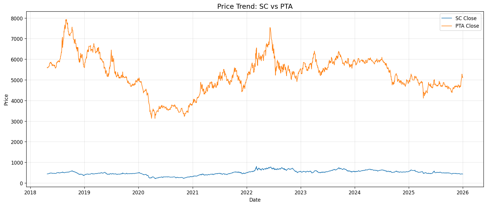
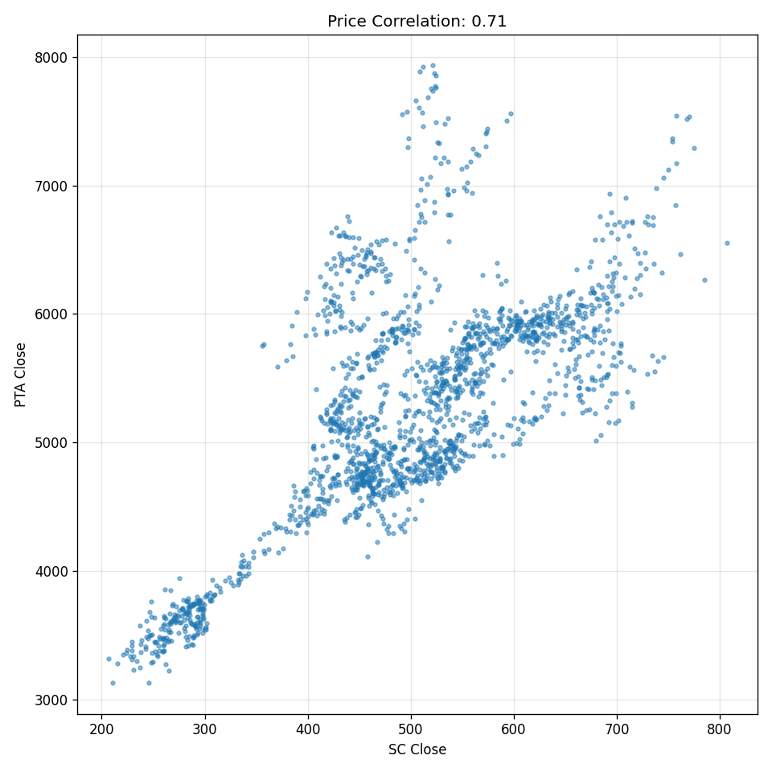
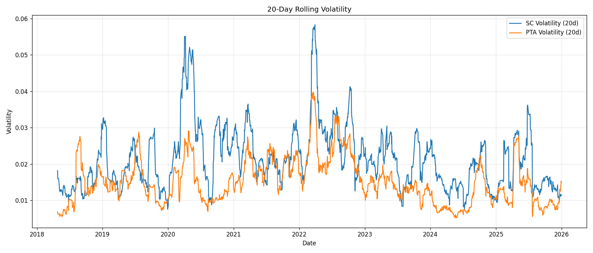
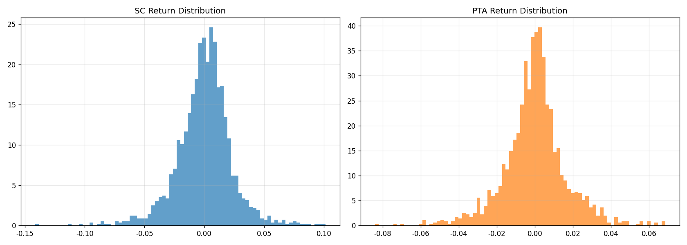

# 原油SC + PTA 投资分析报告

## 1. 研究设计与写作目的

### 1.1 选题背景
原油（SC）与精对苯二甲酸（PTA）是能源化工产业链中的关键品种。原油价格波动通过炼厂、石化和下游聚酯链传导，对 PTA 成本、上市企业盈利和投机资金面具有显著影响。

### 1.2 决策主体
- **期货交易员与商品宏观投资者**：判断原油与化工品间的价差关系，制定套利、跨品种配对交易策略。
- **聚酯生产企业采购与风险管理部门**：评估 PTA 成本压力、原料价差传导速度与套期保值时机。
- **期货策略研究员**：判断原油趋势对 PTA 价格的驱动强度和风险集中期。

### 1.3 核心问题
- 原油 SC 与 PTA 价格之间是否存在稳定相关关系？
- 两者收益率与波动率的传导特征如何？
- 哪种市场情况适合趋势交易、套保或风险对冲？

## 2. 市场与政策背景

### 2.1 能源化工产业链环境
- 2020-2025 年期间，国际原油市场经历供需冲击、疫情影响和地缘政治扰动。
- PTA 属于聚酯产业链核心原料，其价格对原油、PX 以及下游聚酯需求变化高度敏感。
- 在“双碳”与“碳达峰”背景下，化工企业更关注原料价格传导与成本控制。

### 2.2 研究意义
- 对投资者来说，明确原油和 PTA 之间的价差关系可以提高跨品种套利与期现组合的执行效果。
- 对产业链企业来说，理解波动特征可帮助选择合适的套期保值期限和风险控制策略。

## 3. 数据来源与处理

### 3.1 数据来源
- 原油（SC）主力合约：`SC0`
- PTA 主力合约：`TA0`
- 数据来源：`akshare` API
- 时间范围：2018-04-25 至 2025-12-31
- 样本数量：1866 条交易日数据

### 3.2 数据清洗流程
- 统一日期格式并删除重复记录
- 过滤无效价格和成交量数据
- 计算对数收益率 `ret`
- 计算 20 日滚动波动率 `vol20`
- 对原油与 PTA 数据按日期取交集，保证分析样本一致

### 3.3 数据文件
- `data_raw/`：原始合约行情数据
- `data_clean/final.csv`：清洗后对齐数据
- `plots/`：可视化结果图片
- `01_data_collect.py`、`02_data_clean.py`、`03_visual_eda.py`、`04_analysis_conclusion.py`

## 4. 分析方法

### 4.1 描述统计
- 价格时序图比较原油与 PTA 的长期趋势
- 收益率分布直方图与核密度估计
- 箱线图分析异常波动

### 4.2 相关性与波动分析
- 计算价格、收益率、波动率之间的 Pearson 相关系数
- 统计极端收益率（绝对值 > 3%）发生频率

### 4.3 结论提取
- 从数据中读取价格传导、波动特征和风险偏好信息，并形成可落地建议

## 5. 关键分析结果

### 5.1 价格关系
- 原油 SC 与 PTA 收盘价的相关系数为 **0.71**。
- 这表明两者长期价格趋势显著一致，原油是 PTA 价格趋势的重要驱动因素。

### 5.2 收益率相关性
- 日收益率相关系数为 **0.60**。
- 虽然短期收益率传导弱于价格，但仍表现为中等偏高的同步性。

### 5.3 波动率特征
- SC 20 日滚动波动率均值为 **0.0213**。
- PTA 20 日滚动波动率均值为 **0.0151**。
- 波动率相关系数为 **0.66**，表明两者风险水平具有同步性。

### 5.4 收益率分布与极端风险
- SC 的极端波动天数比例为 **14.47%**。
- PTA 的极端波动天数比例为 **7.82%**。
- SC 的收益率分布更厚尾，意味着价格波动风险更大。

### 5.5 统计事实总结
| 指标 | SC | PTA |
|---|---|---|
| 价格相关系数 | 0.71 | — |
| 收益率相关系数 | 0.60 | — |
| 波动率相关系数 | 0.66 | — |
| 20日均值波动率 | 0.0213 | 0.0151 |
| 极端波动比例 | 14.47% | 7.82% |

## 6. 结论与建议

### 6.1 结论
- 原油对 PTA 的价格传导在长期上显著成立，但短期收益率传导存在一定滞后性。
- SC 的波动性高于 PTA，因此当原油出现剧烈变动时，下游 PTA 市场也可能承压，但风险更集中于原油端。
- PTA 在极端波动日中的表现更为平稳，说明其作为化工原料的价格弹性相对弱一些。

### 6.2 对投资者的建议
- **趋势交易者**：可以重点关注原油趋势信号，当 SC 方向明确时，PTA 通常会跟随。
- **跨品种套利策略**：基于 SC 与 PTA 价格及波动率的稳定相关性，设计配对交易和价差回归策略具有可行性。
- **风险管理者**：在原油高波动期采取套期保值策略，可降低 PTA 成本敞口。

### 6.3 对下游企业的建议
- 采购部门应关注原油价格的周期性拐点，以判断 PTA 成本是否将进一步上行。
- 建议在原油明显上涨阶段提前部署套期保值，避免在高位时被动对冲。

## 7. 局限性与后续研究

- 本次分析仅基于价格与收益率数据，未来可结合 PTA 供需、PX 价差、产业链库存和开工率数据。
- 若要进一步提升研究价值，可以引入滚动相关系数、跨期滞后回归和事件窗口分析。
- 如果需要，后续可增加“政策背景”层面分析，例如国内炼厂开工、化工品供给侧改革与进口依赖变化。

## 8. 交付物清单
- `report.md`
- `slides.md`
- `analysis_summary.txt`
- `plots/` 中可视化图表
- `data_clean/final.csv`

---

*注：本报告已按课程作业要求，明确决策主体、背景、统计事实与实际分析结论。*
